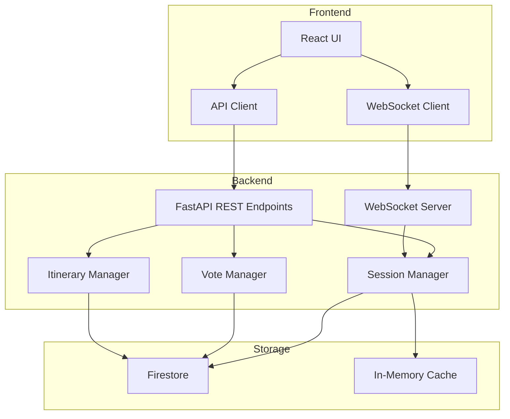

# Design Document: Group Coordination

## Overview

Group Coordination enables collaborative event planning where multiple users can join a planning session, vote on venue options, and view a shared real-time itinerary. The feature builds on existing `FriendGroup`, `User`, and `Event` models while adding new components for session management, voting, and real-time synchronization.

The architecture follows a client-server model with WebSocket/SSE for real-time updates, REST APIs for CRUD operations, and Firestore for persistent storage.

## Architecture



## Components and Interfaces

### 1. Planning Session Service

Manages the lifecycle of planning sessions including creation, joining, and finalization.

```python
class PlanningSessionService:
    async def create_session(self, organizer_id: str, name: str, expiry_hours: int = 72) -> PlanningSession:
        """Create a new planning session with a unique invite token."""
        
    async def join_session(self, invite_token: str, display_name: str) -> Participant:
        """Join a session via invite link. Returns participant info."""
        
    async def get_session(self, session_id: str) -> PlanningSession:
        """Retrieve session by ID."""
        
    async def get_session_by_token(self, invite_token: str) -> PlanningSession:
        """Retrieve session by invite token."""
        
    async def revoke_invite(self, session_id: str, organizer_id: str) -> bool:
        """Revoke the invite link for a session."""
        
    async def finalize_session(self, session_id: str, organizer_id: str) -> SessionSummary:
        """Finalize the session and generate summary."""
        
    async def get_participants(self, session_id: str) -> List[Participant]:
        """Get all participants in a session."""
```

### 2. Vote Manager

Handles voting on venue options.

```python
class VoteManager:
    async def add_venue_option(self, session_id: str, venue: VenueOption) -> VenueOption:
        """Add a venue option for voting."""
        
    async def cast_vote(self, session_id: str, venue_id: str, participant_id: str, vote_type: VoteType) -> Vote:
        """Cast or update a vote on a venue."""
        
    async def get_votes(self, session_id: str, venue_id: str) -> VoteTally:
        """Get vote tally for a venue."""
        
    async def get_ranked_venues(self, session_id: str) -> List[RankedVenue]:
        """Get venues ranked by vote count."""
        
    async def get_participant_votes(self, session_id: str, participant_id: str) -> List[Vote]:
        """Get all votes by a participant."""
```

### 3. Itinerary Manager

Manages the shared itinerary.

```python
class ItineraryManager:
    async def add_to_itinerary(self, session_id: str, venue_id: str, scheduled_time: datetime) -> ItineraryItem:
        """Add a venue to the itinerary."""
        
    async def remove_from_itinerary(self, session_id: str, item_id: str) -> bool:
        """Remove an item from the itinerary."""
        
    async def get_itinerary(self, session_id: str) -> List[ItineraryItem]:
        """Get the full itinerary sorted chronologically."""
        
    async def reorder_itinerary(self, session_id: str, item_ids: List[str]) -> List[ItineraryItem]:
        """Reorder itinerary items."""
```

### 4. Comment Service

Handles comments on venue options.

```python
class CommentService:
    async def add_comment(self, session_id: str, venue_id: str, participant_id: str, text: str) -> Comment:
        """Add a comment to a venue. Validates character limit."""
        
    async def get_comments(self, session_id: str, venue_id: str) -> List[Comment]:
        """Get comments for a venue in chronological order."""
```

### 5. Real-Time Broadcast Service

Handles WebSocket connections and event broadcasting.

```python
class BroadcastService:
    async def connect(self, session_id: str, participant_id: str, websocket: WebSocket) -> None:
        """Register a WebSocket connection for a participant."""
        
    async def disconnect(self, session_id: str, participant_id: str) -> None:
        """Remove a WebSocket connection."""
        
    async def broadcast(self, session_id: str, event: SessionEvent) -> None:
        """Broadcast an event to all connected participants."""
        
    async def sync_state(self, session_id: str, participant_id: str) -> SessionState:
        """Get full session state for reconnection sync."""
```

## Data Models

### PlanningSession

```python
@dataclass
class PlanningSession:
    id: str
    name: str
    organizer_id: str
    invite_token: str
    invite_expires_at: datetime
    invite_revoked: bool
    status: SessionStatus  # ACTIVE, FINALIZED, ARCHIVED
    created_at: datetime
    updated_at: datetime
    participant_ids: List[str]
```

### Participant

```python
@dataclass
class Participant:
    id: str
    session_id: str
    display_name: str
    joined_at: datetime
    is_organizer: bool
```

### VenueOption

```python
@dataclass
class VenueOption:
    id: str
    session_id: str
    place_id: str  # Google Places ID
    name: str
    address: str
    rating: Optional[float]
    price_level: Optional[int]
    photo_url: Optional[str]
    suggested_at: datetime
    suggested_by: str  # "agent" or participant_id
```

### Vote

```python
@dataclass
class Vote:
    id: str
    session_id: str
    venue_id: str
    participant_id: str
    vote_type: VoteType  # UPVOTE, DOWNVOTE, NEUTRAL
    created_at: datetime
    updated_at: datetime
```

### ItineraryItem

```python
@dataclass
class ItineraryItem:
    id: str
    session_id: str
    venue_id: str
    scheduled_time: datetime
    added_at: datetime
    added_by: str
    order: int
```

### Comment

```python
@dataclass
class Comment:
    id: str
    session_id: str
    venue_id: str
    participant_id: str
    text: str
    created_at: datetime
```

### SessionSummary

```python
@dataclass
class SessionSummary:
    session_id: str
    session_name: str
    finalized_at: datetime
    participants: List[Participant]
    itinerary: List[ItineraryItem]
    share_url: str
```

## Correctness Properties

*A property is a characteristic or behavior that should hold true across all valid executions of a system-essentially, a formal statement about what the system should do. Properties serve as the bridge between human-readable specifications and machine-verifiable correctness guarantees.*

### Property 1: Invite token uniqueness
*For any* set of created planning sessions, all generated invite tokens SHALL be unique and have sufficient entropy (at least 128 bits).
**Validates: Requirements 1.1**

### Property 2: Participant list completeness
*For any* planning session with N joined participants, the participant list SHALL contain exactly N entries with correct display names.
**Validates: Requirements 1.4**

### Property 3: Invite revocation preserves participants
*For any* planning session with existing participants, revoking the invite link SHALL preserve all existing participants while preventing new joins.
**Validates: Requirements 1.5**

### Property 4: Vote tally accuracy
*For any* venue with votes cast, the vote tally SHALL equal the count of distinct participant votes for that venue.
**Validates: Requirements 2.2, 2.4**

### Property 5: Vote change consistency
*For any* participant changing their vote on a venue, the total vote count SHALL remain unchanged (one vote per participant per venue).
**Validates: Requirements 2.3, 2.5**

### Property 6: Itinerary chronological ordering
*For any* itinerary with multiple items, the items SHALL be sorted in ascending order by scheduled_time.
**Validates: Requirements 3.2**

### Property 7: Itinerary removal consistency
*For any* itinerary with N items, removing one item SHALL result in exactly N-1 items with the removed item absent.
**Validates: Requirements 3.3**

### Property 8: Session state synchronization
*For any* participant reconnecting to a session, the synchronized state SHALL match the current session state exactly.
**Validates: Requirements 3.4**

### Property 9: Finalization immutability
*For any* finalized session, all modification operations (add venue, cast vote, add to itinerary) SHALL be rejected.
**Validates: Requirements 3.5**

### Property 10: Venue ranking by votes
*For any* set of venues with votes, the ranked list SHALL be sorted in descending order by vote count.
**Validates: Requirements 4.1**

### Property 11: Summary completeness
*For any* finalized session, the generated summary SHALL contain all itinerary items, their times, addresses, and all participant names.
**Validates: Requirements 4.5**

### Property 12: Session serialization round-trip
*For any* valid planning session, serializing to JSON then deserializing SHALL produce an equivalent session object.
**Validates: Requirements 5.4, 5.5**

### Property 13: Comment chronological ordering
*For any* venue with multiple comments, the comments SHALL be sorted in ascending order by created_at timestamp.
**Validates: Requirements 6.2**

## Error Handling

### Session Errors
- `SessionNotFoundError`: Session ID or invite token not found
- `SessionExpiredError`: Invite link has expired
- `SessionFinalizedError`: Attempting to modify a finalized session
- `InviteRevokedError`: Invite link has been revoked

### Authorization Errors
- `NotOrganizerError`: Non-organizer attempting organizer-only action
- `NotParticipantError`: User not a participant in the session

### Validation Errors
- `CommentTooLongError`: Comment exceeds 500 character limit
- `InvalidVoteTypeError`: Invalid vote type provided
- `DuplicateParticipantError`: Participant already in session

### Error Response Format
```json
{
  "error": "SessionFinalizedError",
  "message": "This planning session has been finalized and cannot be modified",
  "session_id": "abc123",
  "status_code": 400
}
```

## Testing Strategy

### Unit Testing
- Test each service method in isolation with mocked dependencies
- Test data model validation and serialization
- Test error conditions and edge cases

### Property-Based Testing
Using `hypothesis` library for Python property tests:

- **Property 1**: Generate random session creations, verify token uniqueness
- **Property 4-5**: Generate random vote sequences, verify tally accuracy
- **Property 6, 13**: Generate random timestamps, verify sorting
- **Property 12**: Generate random session objects, verify round-trip

Each property test will run a minimum of 100 iterations.

Property tests must be tagged with: `**Feature: group-coordination, Property {number}: {property_text}**`

### Integration Testing
- Test full session lifecycle: create → join → vote → finalize
- Test WebSocket broadcast delivery
- Test Firestore persistence and retrieval
- Test concurrent operations (multiple participants voting simultaneously)

### Frontend Testing
- Component tests for VenueCard, VoteButton, ItineraryView
- Integration tests for real-time updates
- E2E tests for complete user flows
