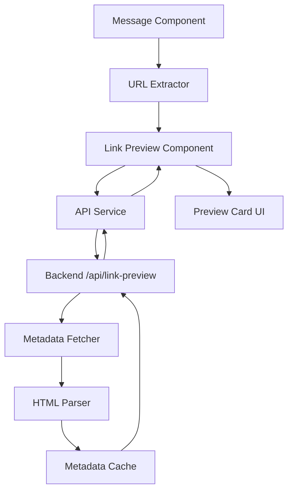

# Design Document

## Overview

This feature adds rich link preview cards to chat messages, similar to how links appear in Slack, Discord, or Twitter. When URLs are detected in assistant messages, the system fetches metadata (title, description, image, favicon) and displays visually appealing preview cards below the message content.

The implementation follows a client-server architecture where:
- Frontend detects URLs and requests metadata
- Backend fetches and parses HTML/metadata to avoid CORS issues
- Frontend renders preview cards with loading states and error handling
- Caching improves performance for repeated URLs

## Architecture

### High-Level Flow

```
User receives message with URL
    ↓
Frontend: Extract URLs from message
    ↓
Frontend: Request metadata from backend API
    ↓
Backend: Fetch HTML from URL
    ↓
Backend: Parse Open Graph/meta tags
    ↓
Backend: Return structured metadata
    ↓
Frontend: Render preview card with metadata
```

### Component Diagram



## Components and Interfaces

### Frontend Components

#### 1. URL Extractor Utility

**Purpose**: Extract valid HTTP/HTTPS URLs from message text

**Location**: `frontend/src/utils/urlExtractor.ts`

**Interface**:
```typescript
interface ExtractedURL {
  url: string;
  startIndex: number;
  endIndex: number;
}

function extractURLs(text: string): ExtractedURL[];
function isValidURL(url: string): boolean;
function shouldExcludeURL(url: string, excludePatterns: string[]): boolean;
```

**Behavior**:
- Uses regex to find HTTP/HTTPS URLs
- Validates URL format
- Excludes localhost, internal IPs, data URIs, blob URLs
- Excludes URLs already handled by venue links feature
- Returns array of URLs with positions for potential highlighting

#### 2. Link Preview Component

**Purpose**: Fetch metadata and render preview cards

**Location**: `frontend/src/components/LinkPreview.tsx`

**Interface**:
```typescript
interface LinkPreviewProps {
  url: string;
  sessionId: string;
}

interface LinkMetadata {
  url: string;
  title?: string;
  description?: string;
  image?: string;
  favicon?: string;
  domain: string;
  error?: string;
}

export function LinkPreview({ url, sessionId }: LinkPreviewProps): JSX.Element;
```

**States**:
- `loading`: Showing skeleton/placeholder
- `loaded`: Displaying full metadata
- `error`: Showing minimal fallback card
- `minimal`: Showing domain-only card (when metadata unavailable)

**Behavior**:
- Fetches metadata on mount
- Shows loading skeleton immediately
- Renders full card when metadata arrives
- Falls back to minimal card on error
- Handles image load failures gracefully

#### 3. Preview Card UI Component

**Purpose**: Render the visual preview card

**Location**: `frontend/src/components/PreviewCard.tsx`

**Interface**:
```typescript
interface PreviewCardProps {
  metadata: LinkMetadata;
  loading?: boolean;
}

export function PreviewCard({ metadata, loading }: PreviewCardProps): JSX.Element;
```

**Visual Structure**:
```
┌─────────────────────────────────────┐
│ [Favicon] Title                     │
│ Description text...                 │
│ ┌─────────────────────────────────┐ │
│ │                                 │ │
│ │      Preview Image              │ │
│ │                                 │ │
│ └─────────────────────────────────┘ │
│ 🔗 domain.com                       │
└─────────────────────────────────────┘
```

**Styling**:
- Vibehuntr gradient border on hover
- Rounded corners (12px)
- Subtle shadow
- Image aspect ratio: 16:9 or 1.91:1 (Open Graph standard)
- Responsive: stacks on mobile, side-by-side on desktop
- Smooth transitions and animations

#### 4. Enhanced Message Component

**Purpose**: Integrate link previews into message display

**Location**: `frontend/src/components/Message.tsx` (existing, enhanced)

**Changes**:
- Add URL extraction after message content
- Render LinkPreview components for each URL
- Exclude URLs already handled by venue links
- Maintain existing venue link button functionality

### Backend Components

#### 1. Link Preview API Endpoint

**Purpose**: Fetch and return link metadata

**Location**: `backend/app/api/link_preview.py`

**Interface**:
```python
@router.post("/api/link-preview")
async def get_link_preview(request: LinkPreviewRequest) -> LinkPreviewResponse:
    """
    Fetch metadata for one or more URLs.
    
    Args:
        request: LinkPreviewRequest with urls list
        
    Returns:
        LinkPreviewResponse with metadata for each URL
    """
    pass

class LinkPreviewRequest(BaseModel):
    urls: list[str]
    session_id: str  # For potential caching per session

class LinkPreviewResponse(BaseModel):
    previews: list[LinkMetadata]

class LinkMetadata(BaseModel):
    url: str
    title: Optional[str] = None
    description: Optional[str] = None
    image: Optional[str] = None
    favicon: Optional[str] = None
    domain: str
    error: Optional[str] = None
```

**Behavior**:
- Validates URLs
- Fetches HTML content with timeout (5 seconds)
- Parses metadata
- Returns results for all URLs (even if some fail)
- Logs errors without exposing internal details

#### 2. Metadata Fetcher Service

**Purpose**: Fetch HTML content from URLs

**Location**: `backend/app/services/metadata_fetcher.py`

**Interface**:
```python
class MetadataFetcher:
    def __init__(self, timeout: int = 5, max_size: int = 5_000_000):
        """Initialize fetcher with timeout and max response size."""
        pass
    
    async def fetch_html(self, url: str) -> str:
        """
        Fetch HTML content from URL.
        
        Args:
            url: The URL to fetch
            
        Returns:
            HTML content as string
            
        Raises:
            FetchError: If fetch fails or times out
        """
        pass
    
    def is_valid_url(self, url: str) -> bool:
        """Validate URL format and scheme."""
        pass
    
    def should_exclude(self, url: str) -> bool:
        """Check if URL should be excluded from fetching."""
        pass
```

**Behavior**:
- Uses `httpx` for async HTTP requests
- Sets user agent: "VibehuntrBot/1.0"
- Follows redirects (max 3)
- Enforces timeout (5 seconds)
- Limits response size (5MB)
- Handles SSL errors gracefully
- Excludes localhost, private IPs, data URIs

#### 3. HTML Parser Service

**Purpose**: Extract metadata from HTML

**Location**: `backend/app/services/html_parser.py`

**Interface**:
```python
class HTMLParser:
    def parse_metadata(self, html: str, url: str) -> LinkMetadata:
        """
        Parse HTML and extract metadata.
        
        Args:
            html: HTML content
            url: Original URL (for resolving relative URLs)
            
        Returns:
            LinkMetadata with extracted information
        """
        pass
    
    def _extract_open_graph(self, soup: BeautifulSoup) -> dict:
        """Extract Open Graph meta tags."""
        pass
    
    def _extract_twitter_card(self, soup: BeautifulSoup) -> dict:
        """Extract Twitter Card meta tags."""
        pass
    
    def _extract_standard_meta(self, soup: BeautifulSoup) -> dict:
        """Extract standard HTML meta tags."""
        pass
    
    def _resolve_url(self, base_url: str, relative_url: str) -> str:
        """Resolve relative URLs to absolute."""
        pass
```

**Parsing Priority**:
1. Open Graph tags (`og:title`, `og:description`, `og:image`)
2. Twitter Card tags (`twitter:title`, `twitter:description`, `twitter:image`)
3. Standard meta tags (`<title>`, `<meta name="description">`)
4. Fallback to domain name

**Behavior**:
- Uses BeautifulSoup4 for HTML parsing
- Handles malformed HTML gracefully
- Resolves relative image URLs to absolute
- Extracts favicon from `<link rel="icon">` or `/favicon.ico`
- Sanitizes extracted text (trim, decode entities)
- Returns partial metadata if some fields missing

#### 4. Metadata Cache Service

**Purpose**: Cache metadata to improve performance

**Location**: `backend/app/services/metadata_cache.py`

**Interface**:
```python
class MetadataCache:
    def __init__(self, ttl: int = 3600):
        """Initialize cache with TTL in seconds."""
        pass
    
    async def get(self, url: str) -> Optional[LinkMetadata]:
        """Get cached metadata for URL."""
        pass
    
    async def set(self, url: str, metadata: LinkMetadata) -> None:
        """Cache metadata for URL."""
        pass
    
    async def clear(self) -> None:
        """Clear all cached metadata."""
        pass
```

**Implementation**:
- In-memory cache using Python dict
- TTL: 1 hour (configurable)
- LRU eviction when cache size exceeds limit (1000 entries)
- Thread-safe using asyncio locks
- Optional: Redis backend for production (future enhancement)

## Data Models

### Frontend Types

```typescript
// frontend/src/types/linkPreview.ts

export interface LinkMetadata {
  url: string;
  title?: string;
  description?: string;
  image?: string;
  favicon?: string;
  domain: string;
  error?: string;
}

export interface LinkPreviewRequest {
  urls: string[];
  session_id: string;
}

export interface LinkPreviewResponse {
  previews: LinkMetadata[];
}

export interface ExtractedURL {
  url: string;
  startIndex: number;
  endIndex: number;
}
```

### Backend Models

```python
# backend/app/models/link_preview.py

from pydantic import BaseModel, HttpUrl
from typing import Optional

class LinkPreviewRequest(BaseModel):
    """Request model for link preview endpoint."""
    urls: list[str]
    session_id: str

class LinkMetadata(BaseModel):
    """Metadata extracted from a URL."""
    url: str
    title: Optional[str] = None
    description: Optional[str] = None
    image: Optional[str] = None
    favicon: Optional[str] = None
    domain: str
    error: Optional[str] = None

class LinkPreviewResponse(BaseModel):
    """Response model for link preview endpoint."""
    previews: list[LinkMetadata]
```


## Correctness Properties

*A property is a characteristic or behavior that should hold true across all valid executions of a system-essentially, a formal statement about what the system should do. Properties serve as the bridge between human-readable specifications and machine-verifiable correctness guarantees.*

### Property Reflection

Before defining properties, let's identify and eliminate redundancy:

- Properties 1.1 and 6.1-6.5 all relate to URL filtering - these can be combined into comprehensive URL extraction properties
- Properties 1.4, 5.1, 5.2, 5.4 all relate to error handling - these can be consolidated
- Properties 3.2, 3.3, 3.4 describe the metadata fetching pipeline - these can be combined
- Properties 4.1 and 4.2 describe loading behavior - keep separate as they test different aspects

### Core Properties

**Property 1: URL extraction completeness**

*For any* message text containing HTTP/HTTPS URLs, the URL extractor should identify all valid URLs and exclude invalid ones, localhost addresses, data URIs, blob URLs, and URLs matching exclusion patterns.

**Validates: Requirements 1.1, 6.1, 6.2, 6.3, 6.5**

---

**Property 2: Venue link deduplication**

*For any* message containing URLs that match the venue link pattern (with venue name, website, and Place ID), those URLs should be excluded from link preview generation to avoid duplication.

**Validates: Requirements 6.4**

---

**Property 3: Metadata fetch attempt**

*For any* valid URL that passes filtering, the backend should attempt to fetch HTML content and parse metadata, returning a structured response with title, description, image, favicon, and domain fields (even if some are empty).

**Validates: Requirements 1.2, 3.2, 3.3, 3.4**

---

**Property 4: Preview card rendering with metadata**

*For any* metadata object with at least a URL and domain, the preview card component should render successfully and include all available fields in the output.

**Validates: Requirements 1.3**

---

**Property 5: Error handling fallback**

*For any* URL where metadata fetch fails (404, 5xx, timeout, parse error, malformed URL), the system should display a minimal preview card with at least the domain name, or no card at all for malformed URLs.

**Validates: Requirements 1.4, 5.1, 5.2, 5.3, 5.4**

---

**Property 6: Multiple URL ordering**

*For any* message containing multiple valid URLs, the preview cards should be displayed in the same order as the URLs appear in the message text.

**Validates: Requirements 1.5**

---

**Property 7: Image fallback handling**

*For any* metadata object without an image field, the preview card should render with a fallback element (icon or gradient) instead of an image.

**Validates: Requirements 2.4, 5.5**

---

**Property 8: Frontend-backend integration**

*For any* message with detected URLs, the frontend should send a POST request to `/api/link-preview` with the URLs and session_id, and the backend should return a response with the same number of preview objects as input URLs.

**Validates: Requirements 3.1**

---

**Property 9: Metadata caching**

*For any* URL that has been fetched within the cache TTL period, a subsequent fetch request should return the cached metadata without making another HTTP request to the original URL.

**Validates: Requirements 3.5**

---

**Property 10: Async rendering**

*For any* message with URLs, the message content should render immediately (synchronously) while preview cards render asynchronously after metadata is fetched.

**Validates: Requirements 4.1**

---

**Property 11: Fetch timeout**

*For any* URL where the fetch operation exceeds 5 seconds, the system should timeout and return a minimal preview with an error indicator.

**Validates: Requirements 4.4**

---

**Property 12: HTML parsing robustness**

*For any* HTML content (including malformed HTML), the parser should not crash and should return at least a partial metadata object with the domain field populated.

**Validates: Requirements 3.3, 5.4**

---

### Example-Based Tests

These are specific scenarios that should be tested with concrete examples:

**Example 1: Security attributes**

When a preview card is clicked, the link should open with `target="_blank"` and `rel="noopener noreferrer"` attributes.

**Validates: Requirements 2.5**

---

**Example 2: Loading skeleton**

When metadata is being fetched, a loading skeleton should be visible in the preview card area.

**Validates: Requirements 4.2**

---

**Example 3: ARIA labels**

Preview cards should include `role="link"` and `aria-label` attributes with descriptive text.

**Validates: Requirements 7.1**

---

**Example 4: Image alt text**

When an image is displayed in a preview card, it should have an `alt` attribute with either the metadata description or a fallback like "Preview image for [domain]".

**Validates: Requirements 7.4**

---

## Error Handling

### Frontend Error Handling

**URL Extraction Errors**:
- Invalid URL format → Skip URL, don't create preview
- Excluded URL pattern → Skip URL silently
- No URLs found → Don't render preview section

**API Request Errors**:
- Network error → Show minimal card with "Unable to load preview"
- Timeout → Show minimal card with domain only
- 4xx/5xx response → Show minimal card with error message

**Rendering Errors**:
- Missing metadata fields → Render partial card with available data
- Image load failure → Hide image, show text-only card
- Component error → Catch with error boundary, show fallback UI

### Backend Error Handling

**URL Validation Errors**:
- Malformed URL → Return error in metadata object
- Excluded URL → Return error indicating URL was filtered
- Invalid scheme → Return error for non-HTTP/HTTPS

**Fetch Errors**:
- Connection timeout → Return error after 5 seconds
- DNS resolution failure → Return error with domain info
- SSL/TLS error → Return error, don't expose certificate details
- HTTP 4xx/5xx → Return error with status code (sanitized)
- Redirect loop → Return error after max redirects

**Parsing Errors**:
- Invalid HTML → Parse what's possible, return partial metadata
- Missing meta tags → Fall back to title tag or domain
- Relative URL resolution failure → Use original URL
- Character encoding issues → Attempt UTF-8 decode, fall back to ASCII

**Cache Errors**:
- Cache miss → Fetch normally
- Cache corruption → Clear entry, fetch fresh
- Cache full → Evict LRU entries

### Error Logging

All errors should be logged with:
- Error type and message
- URL that caused the error
- Session ID for tracing
- Timestamp
- Stack trace (backend only, not exposed to frontend)

## Testing Strategy

### Unit Tests

**Frontend**:
- `urlExtractor.test.ts`: Test URL extraction with various message formats
  - Messages with single URL
  - Messages with multiple URLs
  - Messages with no URLs
  - URLs with query parameters
  - URLs with fragments
  - Malformed URLs
  - Excluded URL patterns

- `LinkPreview.test.tsx`: Test component rendering
  - Render with full metadata
  - Render with partial metadata
  - Render loading state
  - Render error state
  - Handle image load failure

- `PreviewCard.test.tsx`: Test card UI
  - Display all metadata fields
  - Display fallback when image missing
  - Apply correct styling classes
  - Include security attributes on link

**Backend**:
- `test_metadata_fetcher.py`: Test HTML fetching
  - Fetch valid URL
  - Handle timeout
  - Handle connection errors
  - Handle redirects
  - Validate URL format
  - Exclude filtered URLs

- `test_html_parser.py`: Test metadata extraction
  - Parse Open Graph tags
  - Parse Twitter Card tags
  - Parse standard meta tags
  - Handle missing tags
  - Handle malformed HTML
  - Resolve relative URLs

- `test_metadata_cache.py`: Test caching
  - Cache hit returns cached data
  - Cache miss fetches fresh data
  - Cache expiration after TTL
  - Cache eviction when full

- `test_link_preview_api.py`: Test API endpoint
  - Valid request returns metadata
  - Invalid URLs return errors
  - Multiple URLs handled correctly
  - Error responses formatted correctly

### Property-Based Tests

We will use Hypothesis (Python) and fast-check (TypeScript) for property-based testing.

**Frontend Properties** (using fast-check):

- **Property 1**: For any string, extractURLs should only return valid HTTP/HTTPS URLs
- **Property 6**: For any message with N URLs, preview cards should render in the same order
- **Property 7**: For any metadata without image, fallback element should be present

**Backend Properties** (using Hypothesis):

- **Property 3**: For any valid URL, fetch_metadata should return a dict with required keys
- **Property 9**: For any URL, fetching twice within TTL should return identical results
- **Property 11**: For any URL, fetch should timeout after 5 seconds
- **Property 12**: For any HTML string, parse_metadata should not raise exceptions

### Integration Tests

**End-to-End Flow**:
1. Create message with URLs
2. Frontend extracts URLs
3. Frontend calls `/api/link-preview`
4. Backend fetches and parses metadata
5. Frontend renders preview cards
6. Verify cards display correct information

**Error Scenarios**:
1. Backend returns error → Frontend shows minimal card
2. Network timeout → Frontend shows timeout message
3. Invalid URL → No preview card rendered

**Performance Tests**:
1. Measure metadata fetch time (should be < 5s)
2. Measure cache hit performance (should be < 10ms)
3. Measure preview card render time (should be < 100ms)

### Test Configuration

**Property-Based Test Settings**:
- Minimum iterations: 100 per property
- Timeout per test: 30 seconds
- Shrinking enabled for failure cases

**Test Tagging**:
Each property-based test must include a comment with:
```python
# Feature: link-preview-cards, Property 3: Metadata fetch attempt
# Validates: Requirements 1.2, 3.2, 3.3, 3.4
```

## Security Considerations

### URL Validation

- Only allow HTTP and HTTPS schemes
- Block localhost and private IP ranges (10.0.0.0/8, 172.16.0.0/12, 192.168.0.0/16)
- Block link-local addresses (169.254.0.0/16)
- Block loopback addresses (127.0.0.0/8)
- Validate URL format before fetching

### Fetch Security

- Set user agent to identify bot: "VibehuntrBot/1.0"
- Follow redirects with limit (max 3)
- Enforce timeout (5 seconds)
- Limit response size (5MB)
- Don't expose internal errors to frontend
- Don't follow redirects to private IPs

### Content Security

- Sanitize extracted text (remove scripts, dangerous HTML)
- Validate image URLs before displaying
- Use `rel="noopener noreferrer"` on all external links
- Don't execute JavaScript from fetched pages
- Don't render HTML from fetched pages (text only)

### Rate Limiting

- Limit preview requests per session (e.g., 50 per hour)
- Limit concurrent fetches per session (e.g., 5)
- Cache results to reduce external requests
- Return cached errors to avoid retry storms

## Performance Considerations

### Frontend Optimization

- Lazy load preview cards (only fetch when in viewport)
- Debounce preview requests (wait for message to finish streaming)
- Use React.memo for PreviewCard component
- Optimize image loading with lazy loading attribute
- Use CSS containment for preview cards

### Backend Optimization

- Cache metadata for 1 hour (configurable)
- Use connection pooling for HTTP requests
- Implement request deduplication (don't fetch same URL twice concurrently)
- Use async/await for parallel fetching
- Limit HTML parsing to first 100KB of response

### Caching Strategy

- Cache successful fetches for 1 hour
- Cache errors for 5 minutes (shorter TTL)
- Use URL as cache key (normalized)
- Implement LRU eviction (max 1000 entries)
- Optional: Use Redis for distributed caching

## Deployment Considerations

### Configuration

Environment variables:
- `LINK_PREVIEW_ENABLED`: Enable/disable feature (default: true)
- `LINK_PREVIEW_TIMEOUT`: Fetch timeout in seconds (default: 5)
- `LINK_PREVIEW_CACHE_TTL`: Cache TTL in seconds (default: 3600)
- `LINK_PREVIEW_MAX_SIZE`: Max response size in bytes (default: 5000000)
- `LINK_PREVIEW_EXCLUDED_DOMAINS`: Comma-separated list of domains to exclude

### Monitoring

Metrics to track:
- Preview fetch success rate
- Average fetch time
- Cache hit rate
- Error rate by error type
- Number of previews per message

Alerts:
- Fetch success rate < 80%
- Average fetch time > 3 seconds
- Cache hit rate < 50%
- Error rate > 20%

### Rollout Strategy

1. Deploy backend changes first (API endpoint, services)
2. Test backend with curl/Postman
3. Deploy frontend changes (URL extraction, preview components)
4. Enable feature flag for internal testing
5. Monitor metrics for 24 hours
6. Gradually roll out to users (10%, 50%, 100%)
7. Monitor error rates and performance

### Rollback Plan

If issues occur:
1. Disable feature flag (`LINK_PREVIEW_ENABLED=false`)
2. Frontend will skip preview rendering
3. Backend will return empty responses
4. No data loss (feature is read-only)
5. Investigate and fix issues
6. Re-enable feature flag

## Future Enhancements

### Phase 2 Features

- **Video previews**: Detect and embed YouTube, Vimeo videos
- **Rich embeds**: Support for Twitter, GitHub, Spotify embeds
- **PDF previews**: Show first page thumbnail for PDF links
- **Link unfurling**: Expand shortened URLs (bit.ly, tinyurl)

### Phase 3 Features

- **User preferences**: Allow users to disable previews
- **Preview editing**: Let users customize preview appearance
- **Analytics**: Track which previews are clicked
- **A/B testing**: Test different preview layouts

### Infrastructure Improvements

- **Redis caching**: Replace in-memory cache with Redis
- **CDN integration**: Cache preview images on CDN
- **Microservice**: Extract preview service to separate deployment
- **Rate limiting**: Implement per-user rate limits
